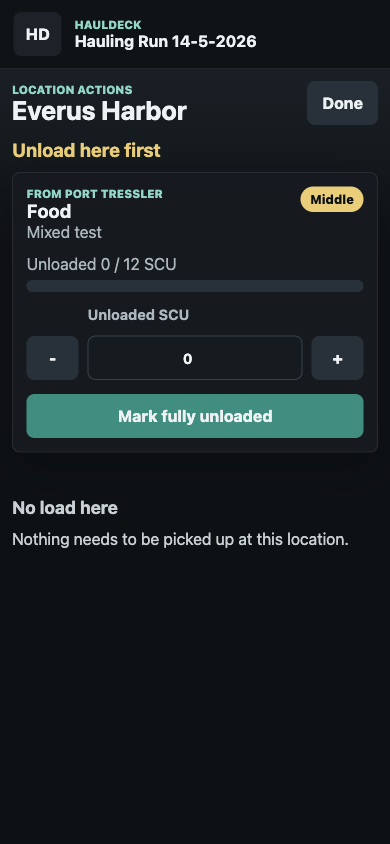

# HaulDeck

HaulDeck is an offline-first cargo run organizer for Star Citizen hauling contracts. It helps you stack multiple contracts in one run without mixing cargo for different destinations.

The app is intended as a personal in-game companion. It runs entirely in the browser as a static GitHub Pages app. There is no backend, login, or cloud sync.

Live app: [https://bjornb2.github.io/HaulDeck/](https://bjornb2.github.io/HaulDeck/)

> Unofficial fan tool. HaulDeck is not affiliated with Cloud Imperium Games, Roberts Space Industries, or Star Citizen.

## AI Disclosure

HaulDeck was built with AI assistance. The code, UI iterations, route planner logic, and documentation were largely designed and implemented together with an AI coding assistant. The app should still be tested during real hauling runs before relying on it heavily.

## What It Does

- Groups multiple hauling contracts into one run
- Supports multiple cargo lines per contract
- Tracks commodity, SCU amount, destination, and ship zone per cargo line
- Builds a stop plan with pickup and delivery stops
- Accounts for ship max SCU when planning the route
- Discourages unnecessary jumps in multi-system routes
- Shows expected SCU on board after each stop
- Lets you mark load/unload actions per location
- Collapses delivered contracts under completed contracts
- Stores runs locally in the browser with IndexedDB
- Runs as a static PWA with no build step

## Screenshots

| Deck and stop plan | Stop actions | Add contract |
| --- | --- | --- |
|  |  |  |

## How To Use

1. Create a new run.
2. Optionally set a start location. New contracts use this as the default pickup location.
3. Set `Ship max SCU` if you want the route planner to respect your cargo capacity.
4. Add contracts with `Add contract`.
5. Add one or more cargo lines per contract.
6. Review the `Stop plan`.
7. Tap `I am here now` when you arrive at a stop.
8. Complete unload actions first, then load actions.
9. Return to the deck to see the next stop.

## Route Planning

The route planner uses a practical heuristic. It tries to:

- Unload cargo first when that frees up useful space
- Plan pickup stops before their deliveries
- Avoid obvious repeated visits
- Stay within the configured ship max SCU
- Heavily penalize inter-system jumps so Stanton/Pyro/Nyx routes do not jump back and forth unnecessarily

This is not a distance-based or quantum-route optimizer. There is no real distance matrix yet. The current planner is meant to be a practical checklist that helps prevent forgotten cargo, mixed stacks, and premature delivery stops.

## Hosting

HaulDeck is deployed on GitHub Pages:

[https://bjornb2.github.io/HaulDeck/](https://bjornb2.github.io/HaulDeck/)

It is also a static web app, so you can host it on any static web host that serves HTML, CSS, JavaScript, JSON, and image assets.

For local testing:

```bash
php -S 127.0.0.1:4173
```

Then open:

```text
http://127.0.0.1:4173
```

Alternative with Python:

```bash
python3 -m http.server 4173
```

No npm install, build step, or server-side runtime is required.

## Data And Privacy

- Runs are stored locally in IndexedDB.
- Nothing is sent to a server by the app.
- Catalog data lives in `public/data/locations.json` and `public/data/commodities.json`.

## Project Structure

```text
/
  index.html
  service-worker.js
  assets/
    app.css
    app.js
    route-planner.js
  public/
    manifest.webmanifest
    data/
      locations.json
      commodities.json
    icons/
      icon.svg
  docs/
    screenshots/
```

## Status

HaulDeck is a working MVP. The main remaining improvements are real route distances, more catalog validation, more practical data from live hauling runs, and ship presets.
