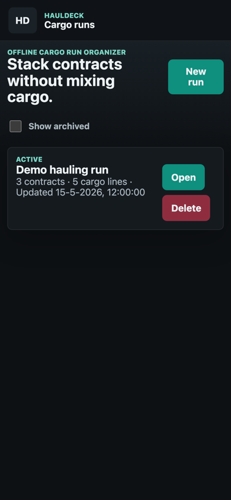
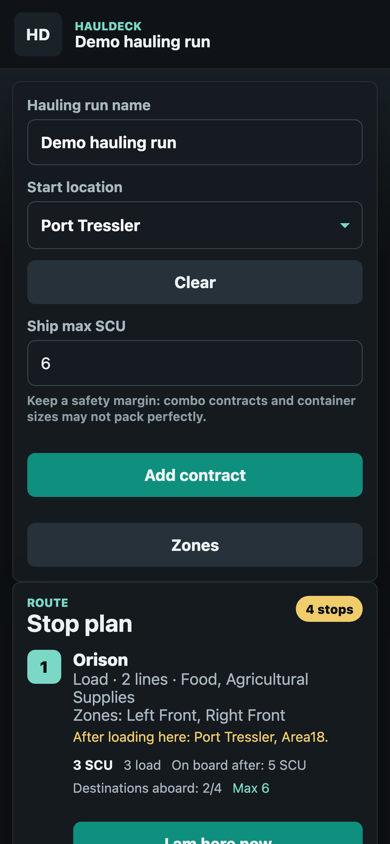
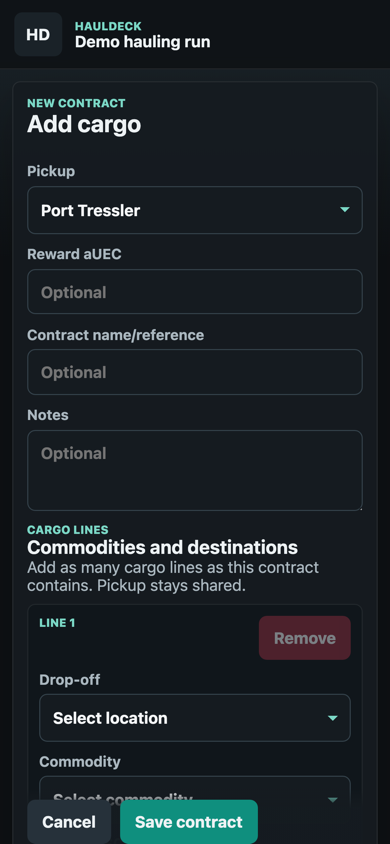
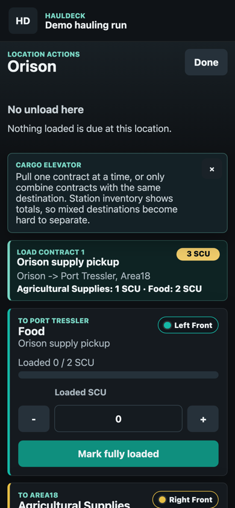
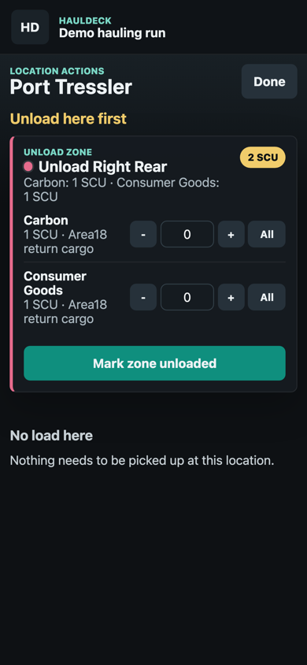
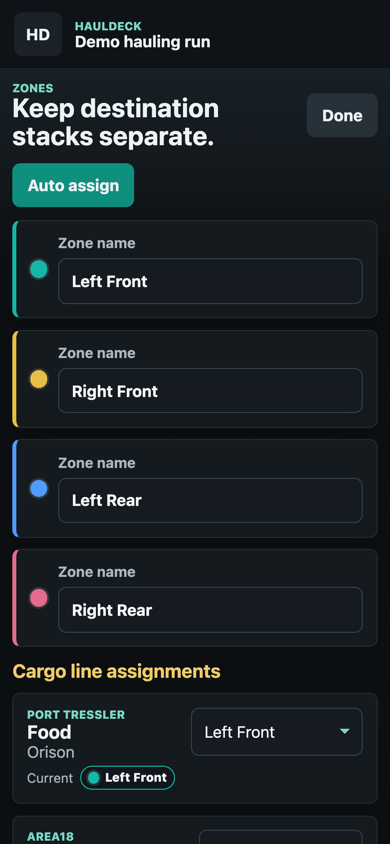

# HaulDeck

HaulDeck is an offline-first cargo run organizer for Star Citizen hauling contracts. It helps you combine multiple hauling contracts into one practical run while keeping destinations, ship zones, loading steps, and unloading steps clear.

The app is intended as a personal in-game companion. It runs entirely in the browser as a static GitHub Pages app. There is no backend, login, or cloud sync.

Live app: [https://bjornb2.github.io/HaulDeck/](https://bjornb2.github.io/HaulDeck/)

> Unofficial fan tool. HaulDeck is not affiliated with Cloud Imperium Games, Roberts Space Industries, or Star Citizen.

## AI Disclosure

HaulDeck was built with AI assistance. The code, UI iterations, route planner logic, and documentation were largely designed and implemented together with an AI coding assistant. The app should still be tested during real hauling runs before relying on it heavily.

## What It Does

- Groups multiple hauling contracts into one run
- Supports multiple cargo lines per contract
- Tracks commodity, SCU amount, destination, and ship zone per cargo line
- Builds a stop plan with pickup and delivery stops
- Accounts for ship max SCU when planning the route
- Accounts for the configured number of cargo zones when deciding what can be carried together
- Discourages unnecessary jumps in multi-system routes
- Shows expected SCU on board after each stop
- Defers split deliveries when it is better to collect all cargo for the same destination first
- Groups loading actions per contract so station inventory totals are easier to match
- Groups unloading actions per ship zone so the main instruction is the physical zone to clear
- Uses color-coded zones across loading, unloading, contracts, and zone settings
- Collapses delivered contracts under completed contracts
- Stores runs locally in the browser with IndexedDB
- Runs as a static PWA with no build step

## Screenshots

Mobile screenshots from a sample hauling run:

| Home | Deck and stop plan | Add contract |
| --- | --- | --- |
|  |  |  |

| Loading actions | Unloading actions | Zone settings |
| --- | --- | --- |
|  |  |  |

## How To Use

1. Create a new run.
2. Optionally set a start location. New contracts use this as the default pickup location.
3. Set `Ship max SCU` if you want the route planner to respect your cargo capacity.
4. Add contracts with `Add contract`.
5. Add one or more cargo lines per contract. Pickup is shared by the contract; each cargo line has its own commodity, SCU amount, destination, and zone.
6. Use `Zones` to review or adjust which ship zone belongs to each destination.
7. Review the `Stop plan`.
8. Tap `I am here now` when you arrive at a stop.
9. Unload first when the page shows unload actions, then load the contracts listed for that location.
10. Return to the deck to see the next stop.

When loading, HaulDeck intentionally groups work by contract. In-game station inventory often shows only totals, so it is safest to pull one contract at a time from the cargo elevator, or only combine contracts that share the same destination.

## Route Planning

The route planner uses a practical heuristic. It tries to:

- Unload cargo first when that frees up useful space
- Plan pickup stops before their deliveries
- Avoid obvious repeated visits
- Stay within the configured ship max SCU
- Stay within the configured cargo zone count, so the plan does not require more simultaneous destination stacks than your ship layout supports
- Delay unloading at the current location when more cargo for that same destination can be collected first
- Heavily penalize inter-system jumps so Stanton/Pyro/Nyx routes do not jump back and forth unnecessarily

This is not a distance-based or quantum-route optimizer. There is no real distance matrix yet. The current planner is meant to be a practical checklist that helps prevent forgotten cargo, mixed stacks, and premature delivery stops.

## Cargo Zones

HaulDeck assumes a zone should normally hold cargo for one destination. Zones are color-coded throughout the app:

- Load cards show the target zone color and name.
- Unload actions are grouped by zone, with one `Mark zone unloaded` action for the whole zone.
- Individual unload lines still have `-`, `+`, and `All` controls for corrections.
- The route planner can adjust the route when too many destinations would need to be on board at once.

The default layout is four zones: `Left Front`, `Right Front`, `Left Rear`, and `Right Rear`. You can rename them in the `Zones` screen.

## Catalog Data

HaulDeck includes local JSON catalogs for:

- Stanton, Pyro, and Nyx cargo locations
- Common hauling commodities, including entries such as `Agricultural Supplies` and `Carbon`

The catalogs are intentionally local and editable in `public/data/locations.json` and `public/data/commodities.json`.

## Hosting

HaulDeck is deployed on GitHub Pages:

[https://bjornb2.github.io/HaulDeck/](https://bjornb2.github.io/HaulDeck/)

It is also a static web app, so you can host it on any static web host that serves HTML, CSS, JavaScript, JSON, and image assets.

For local testing:

```bash
php -S 127.0.0.1:4173
```

Then open:

```text
http://127.0.0.1:4173
```

Alternative with Python:

```bash
python3 -m http.server 4173
```

No npm install, build step, or server-side runtime is required.

## Data And Privacy

- Runs are stored locally in IndexedDB.
- Nothing is sent to a server by the app.
- Catalog data lives in `public/data/locations.json` and `public/data/commodities.json`.
- Installed PWA versions may cache aggressively on iOS; reopening through Safari can help pick up a fresh service worker after updates.

## Project Structure

```text
/
  index.html
  service-worker.js
  assets/
    app.css
    app.js
    route-planner.js
  public/
    manifest.webmanifest
    data/
      locations.json
      commodities.json
    icons/
      icon.svg
  docs/
    screenshots/
```

## Status

HaulDeck is a working MVP. The main remaining improvements are real route distances, more catalog validation, more practical data from live hauling runs, and ship presets.
